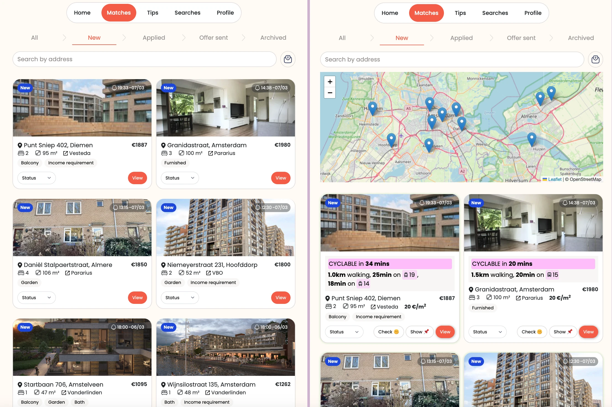

## What is this

A better UI for [Stekkies](https://www.stekkies.com/en/), a housing notification service in the Netherlands. Adds commute analysis, price metrics, and map integration to property listings.

## Pre-requisites

- [Tampermonkey](https://www.tampermonkey.net/) browser extension
- An active Stekkies subscription

## Installation

In the Tampermonkey **Dashboard**, go to **Utilities** → **Import from URL**, paste the following and install:

```text
https://diraneyya.github.io/stekkies-tampermonkey/index.tampermonkey.js
```

On first run, you'll be prompted for a Google Maps API key (needs the Directions API enabled).

## Features

- **Commute info**: public transit directions arriving by 9AM next Tuesday
- **Cyclability**: flags properties under 45 min cycling distance to work
- **Price/m²**: color-coded — green under €20, red over €25
- **Highlights**: garden, balcony, and bath properties get a green glow; student housing is faded out
- **Direct links**: "View" button goes straight to the listing on Funda/Pararius
- **Map**: all properties shown on an interactive OpenStreetMap with a "Show" button per listing
- **Sun check**: link to [ShadeMap](https://shademap.app) for sunlight analysis at each address

## Alpha version

The work address is currently hardcoded.

## Screenshot

Vanilla Stekkies UI on the left, improved interface on the right.

